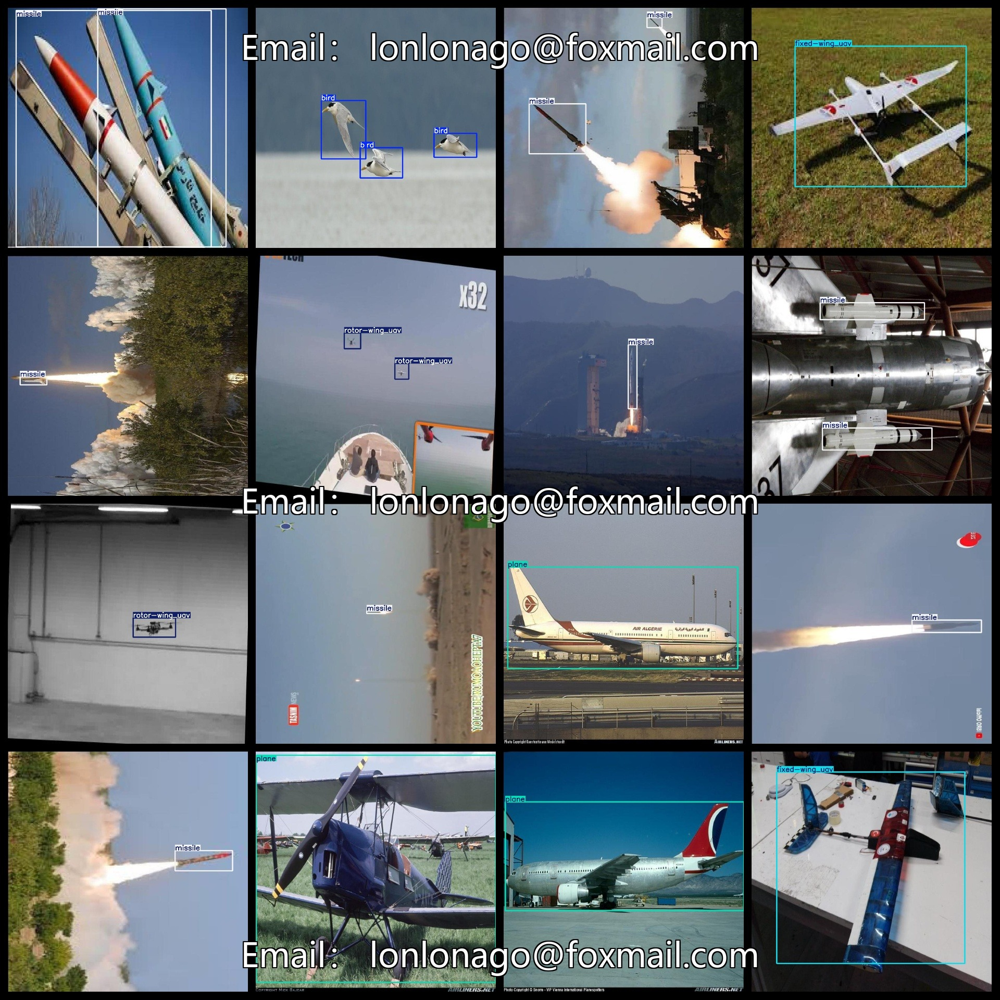
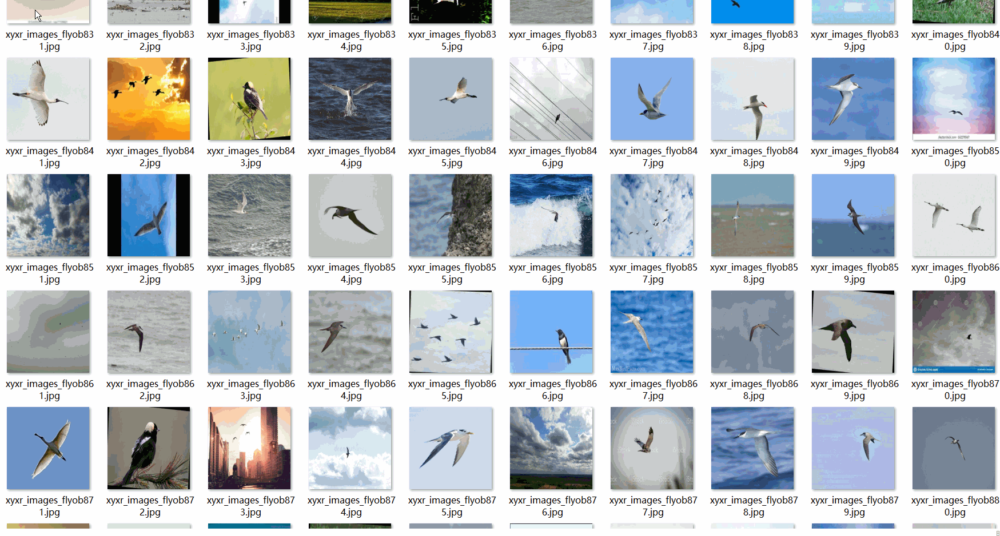

# Flying Object Detection Dataset 10240 imagesVOC+YOLO format（Bird Aircraft Missile Fixed Wing UAV Rot: Wing UAV ）

Flying Object Detection Dataset 10240 sheets VOC + YOLO format (Bird Aircraft Missile Fixed Wing UAV Rotorcraft UAV)

Dataset format: Pascal VOC format + YOLO format (the txt file does not contain the split path, it only contains jpg images and corresponding VOC format xml files and yolo format txt files)

Number of images (number of jpg files): 10240

Number of XML files: 10240

Number of txt files: 10240

Number of callout categories: 5

The Github repository is: datasets_sl

["bird", "fixed-wing_uav", "missile", "plane", "rotor-wing_uav"]

Tags: Bird; Fixed-wing UAV; Missile; Aircraft; Rotary-wing UAV

Number of boxes labeled in each category:

Bird Frame Count = 6772

The number of fixed-wing UAV frames is 1428.

Number of missiles = 4060

Plane Frame Count = 2498

The number of rotor-wing UAV frames is 2894.

Total Frames: 17652

Number of images per category:

Bird has 1401 images.

Fixed-wing UAV has 1350 pictures.

The number of missile images = 2494

Plane ownership count = 2498

The number of images in rotor-wing UAV = 2497

Image resolution: 1024x1024

Use the labeling tool: labelImg

Dataset Augmentation: No

Rules for annotation: Draw a rectangle around the category.

Important note: The dataset does not have been divided into training, validation, and testing sets.

Special Disclaimer: This dataset does not guarantee the accuracy of the trained models or weight files.

Annotation and image details are as follows:

## Images

---

Here is a pay link on Stripe (https://buy.stripe.com/3cs8yP7sY87d0vu9AB). Please contact me lonlonago@foxmail.com after funding $89, and I will send you a complete data files, thank you!

